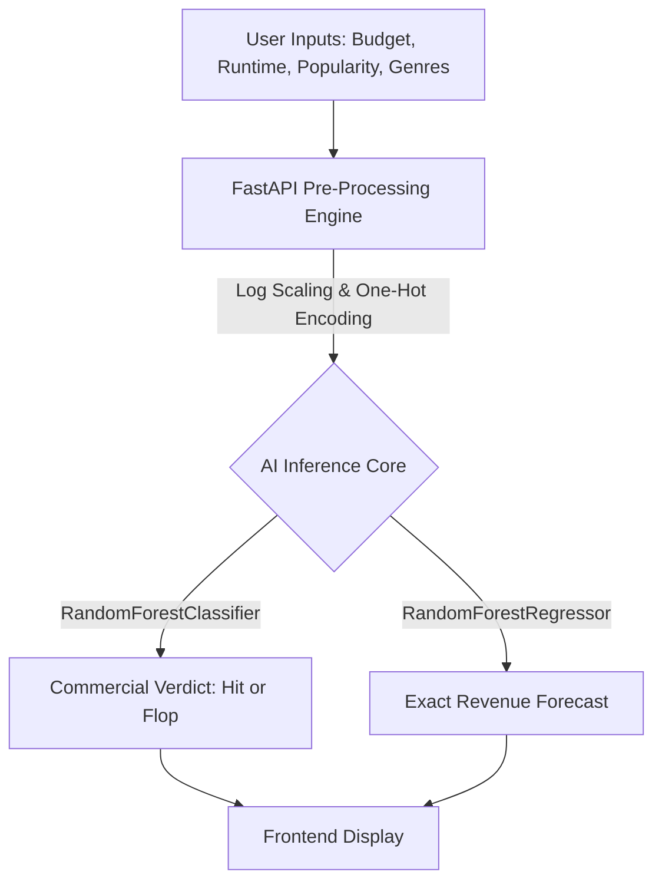

<div align="center">
  
# 🎬 CinePredict: AI Box Office Forecaster

[](https://fastapi.tiangolo.com/)
[](https://scikit-learn.org/)
[](https://developer.mozilla.org/en-US/docs/Web/JavaScript)
[](https://www.chartjs.org/)

**Empowering studios and independent filmmakers with data-driven box office predictions using advanced Machine Learning.**

---
</div>

## 🚀 The Vision

In the high-stakes world of cinema, millions of dollars are gambled on a single weekend. **CinePredict** eliminates the guesswork. By leveraging historical cinematic data and state-of-the-art Random Forest algorithms, this ultra-premium web application simulates a movie's financial trajectory before the cameras even start rolling.

Whether you're predicting if an indie thriller will flop or forecasting the exact revenue of a summer blockbuster, CinePredict serves as the ultimate AI oracle for the film industry.

## ✨ Standout Features

*   🔮 **Dual-Engine AI Predictions:** Powered by two separate machine learning models working in tandem: a Classifier to determine commercial viability (Hit/Flop) and a Regressor to forecast exact box office revenue.
*   🌌 **Ultra-Premium UI/UX:** Built with a stunning, glassmorphism dark-mode aesthetic. Features 3D card tilt effects, animated particle backgrounds, and floating form labels that make the app feel alive.
*   📊 **Real-Time Market Insights:** An interactive Exploratory Data Analysis (EDA) dashboard powered by Chart.js, rendering dynamic insights on genre popularity and budget-revenue correlations.
*   ⚡ **Lightning Fast Backend:** Built on FastAPI, ensuring asynchronous, non-blocking predictions that return in milliseconds.

## 🧠 Machine Learning Architecture

Our prediction engine was rigorously trained on a cleaned dataset of thousands of historical movies. 



### 📈 Model Performance
*   **Commercial Viability (Hit/Flop):** **81.3% Accuracy** *(vs 75% baseline)*
*   **Revenue Forecasting:** **49.6% R-Squared ($R^2$)** 

*The model intelligently explains nearly 50% of the variance in global box office returns—an incredibly respectable metric given the highly volatile and unpredictable nature of the entertainment industry!*

## 💻 Tech Stack

| Domain | Technologies Used |
| :--- | :--- |
| **Backend** | Python, FastAPI, Uvicorn, Pandas, Numpy |
| **Machine Learning** | Scikit-Learn (Random Forest Regressor & Classifier), Joblib |
| **Frontend** | HTML5, Vanilla CSS3 (Glassmorphism), JavaScript (ES6+) |
| **Libraries** | Chart.js (Dashboards), Particles.js (Background), Vanilla-tilt.js (3D effects) |

## 🛠️ Installation & Local Setup

Want to run the cinematic oracle on your own machine? It takes less than 2 minutes.

1. **Clone the repository:**
   ```bash
   git clone https://github.com/RevanthAK1718/Cine_Predict.git
   cd Cine_Predict
   ```

2. **Install the dependencies:**
   *Note: Ensure you are using Python 3.8+*
   ```bash
   pip install -r requirements.txt
   ```

3. **Ignite the server:**
   ```bash
   python app.py
   ```

4. **Experience the magic:**
   Open your browser and navigate to `http://localhost:8000`

## 🔮 Future Scope

*   **NLP Integration:** Analyzing the sentiment of a movie's plot synopsis to factor into the revenue prediction.
*   **Cast Power Score:** Dynamically calculating the box-office draw of specific actors and directors.
*   **Cloud Deployment:** Containerizing the app with Docker and deploying it globally via AWS/GCP.

---
<div align="center">
<i>Built with passion for the future of cinema. 🍿</i>
</div>
