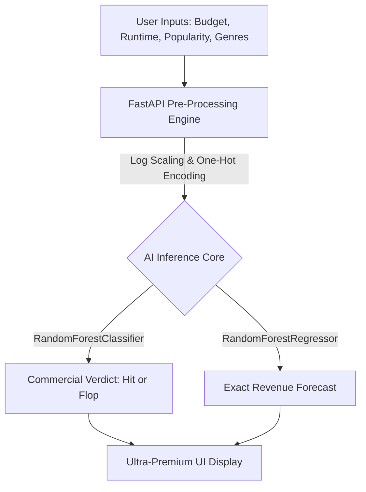

<div align="center">
  
# 🎬 CinePredict: AI Box Office Forecaster

[](https://fastapi.tiangolo.com/)
[](https://scikit-learn.org/)
[](https://developer.mozilla.org/en-US/docs/Web/JavaScript)
[](https://www.chartjs.org/)

**Empowering studios and independent filmmakers with data-driven box office predictions using advanced Machine Learning.**

---
</div>

## 🚀 The Vision

In the high-stakes world of cinema, millions of dollars are gambled on a single weekend. **CinePredict** eliminates the guesswork. By leveraging historical cinematic data and state-of-the-art Random Forest algorithms, this ultra-premium web application simulates a movie's financial trajectory before the cameras even start rolling. 

Whether you're predicting if an indie thriller will flop or forecasting the exact revenue of a summer blockbuster, CinePredict serves as the ultimate AI oracle for the film industry.

---

## 📊 Data Science Core

We rigorously analyzed **4,795 real theatrical releases** from the TMDB 5000 dataset to uncover what actually drives box office success.

### 🧹 Data Engineering & Cleaning
*   **Filtered Reality:** Removed `Rumored` and `Post Production` entries to ensure the models only learned from actual theatrical releases (resulting in 3,228 highly valid modeling rows).
*   **Missing Value Handling:** Intelligently converted fake `$0` budgets and revenues to `NaN` instead of letting them skew the model as "free" movies.
*   **Complex JSON Parsing:** Extracted highly nested metadata (genres, cast, crew, production companies) using `ast.literal_eval`.
*   **Feature Engineering:** Engineered robust targets like `profit`, `roi`, and `is_hit` (ROI > 0). Applied logarithmic transformations (`log1p`) to budgets and revenues to prevent multibillion-dollar blockbusters from dominating the model weights.

### 💡 Key EDA Insights
| Finding | Metric/Value | Takeaway |
|:---|:---:|:---|
| **Budget ↔ Revenue Correlation** | `0.71` | Bigger budgets tend to earn more — but it is far from guaranteed. |
| **Rating ↔ Revenue Correlation** | `0.19` | Critical acclaim barely predicts commercial success. |
| **Most Common Genre** | `Drama` | High volume of releases, but struggles to crack the top 10 by average revenue. |
| **Highest-Earning Genre** | `Animation` | Rarely made, but averages a staggering ~$275M+ when produced. |
| **Best Release Window** | `May-Jun, Nov-Dec` | Nearly 2x the average revenue compared to January or September releases. |

---

## 🧠 Machine Learning Architecture

Our dual-engine prediction core was trained to tackle the chaotic nature of the box office from two different angles: **Classification** and **Regression**.



### 📈 Model Performance Highlights

| Model Architecture | Predictive Task | Performance Metric | Notes |
|:---|:---|:---|:---|
| **Linear Regression** | Predict log(revenue) | $R^2$ = 0.386 | Baseline comparison |
| **Random Forest Regressor** | Predict log(revenue) | **$R^2$ = 0.496** | Explains ~50% of box office variance. |
| **Logistic Regression** | Predict hit/flop | Accuracy ≈ 75% | Naive "always guess hit" baseline |
| **Random Forest Classifier** | Predict hit/flop | **Accuracy = 81.3%** | Highly robust predictive lift over baseline. |

**Top Predictive Features:** `vote_count`, `log_budget`, `popularity`, `runtime`, `vote_average`

> [!NOTE]
> **Known Limitation (Transparency is Key):** The classifier is incredibly strong at catching actual hits (93% recall) but weaker at catching actual flops (45% recall) due to class imbalance in the training data (790 flops vs 2,438 hits). This is a known, documented behavior.

---

## 🌐 The Web Application

To make these models accessible and breathtaking to use, we engineered an **Ultra-Premium Web Application**.

*   **Tech Stack:** 
    *   **Backend:** Python, FastAPI, Uvicorn, Pandas, Numpy, Scikit-Learn.
    *   **Frontend:** HTML5, CSS3 (Advanced Glassmorphism), Vanilla JS (ES6+), Chart.js, Particles.js, Vanilla-tilt.js.
*   **API / Prediction Contract:** The `/predict` POST endpoint dynamically accepts raw user inputs, automatically applies log transformations to the budget, handles the one-hot encoding for the selected genre strictly matching the `feature_cols.pkl` ordering, and inverse-transforms the `log_revenue` prediction back into a beautiful USD currency format for the user.
*   **Interactive Features:** 
    *   **Predictor Form:** A glassmorphism form with floating labels and interactive 3D card tilts.
    *   **AI Engine Diagnostics:** Real-time, animated circular gauges proving model accuracy.
    *   **Market Insights Dashboard:** Dynamic Chart.js widgets rendering EDA data (Revenue by Genre, Popularity distributions) injected straight from the backend via the `/eda-data` endpoint.

---

## 🛠️ Local Setup & Installation

Want to run the cinematic oracle on your own machine? It takes less than 2 minutes.

1. **Clone the repository:**
   ```bash
   git clone https://github.com/RevanthAK1718/Cine_Predict.git
   cd Cine_Predict
   ```

2. **Install the dependencies:**
   *Note: Ensure you are using Python 3.8+*
   ```bash
   pip install -r requirements.txt
   ```

3. **Ignite the server:**
   ```bash
   python app.py
   ```

4. **Experience the magic:**
   Open your browser and navigate to `http://localhost:8000`

---

## 📁 Project Structure
```text
Cine_Predict/
├── app.py                  # The FastAPI application & routing core
├── requirements.txt        # Python dependency manifest
├── revenue_model.pkl       # Trained RandomForestRegressor -> log(revenue)
├── hit_flop_model.pkl      # Trained RandomForestClassifier -> Hit(1) / Flop(0)
├── feature_cols.pkl        # Ordered strict feature mapping
├── genre_columns.pkl       # One-hot genre mapping 
├── cleaned_movies.csv      # Processed dataset powering the EDA backend
├── README.md               # You are here
└── static/                 # Frontend assets
    ├── index.html          # Main UI 
    ├── style.css           # Premium Glassmorphism styling
    └── app.js              # Interactivity, Chart.js, Particles.js, API fetches
```

## 🙏 Credits & Acknowledgements
- **Dataset:** [TMDB 5000 Movie Dataset](https://www.kaggle.com/datasets/tmdb/tmdb-movie-metadata) via Kaggle.
- **Data Science Engine:** Analyzed and trained via Google Colab (pandas, scikit-learn).
- **Architecture:** Engineered for hackathon excellence.

<div align="center">
<i>Built with passion for the future of cinema. 🍿</i>
</div>
